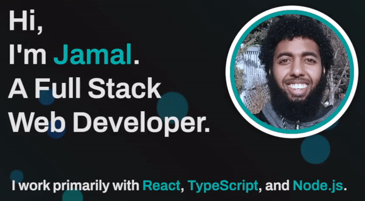

---

### 👋, Thanks For Checking Out My GitHub Page

I'm a Software Developer based in Toronto, Canada. I am proficient in both **Frontend** and **Backend** development and I try to do everything in between. I am a Vim fanatic and an open-source supporter 🚀.

I'm a team player, a self-starter, a learner, and a goal-focused problem solver. I combine my soft skills with my technical experience to provide clients with purposeful software solutions. Ultimately, it's about the team and what I can do to help us win as a whole... Yeah I'm a big sports fan too 😉

- 🔭 I’m currently working on Reproducing the [CodePen Top 100 Pens - 2023](https://codepen.io/2022/popular/pens/)
- 🌱 I’m currently learning Terraform and Kubernetes
- ❓ Ask me about anything related to the MERN stack and related technologies
- ⚡ Fun fact: I use spaces over tabs (I converted in 2022 😅)

## My Skill Set  
<table><tr><td valign="top" width="33%">

### Frontend  

  
  
  
  
  
  
  
  
  
  
  
  
  
  
  
  
  

</td><td valign="top" width="33%">

### Backend  

  
  
  
  
  
  
  
  
  
  
  
  
  
  
  
  
  
  
  
  

</td><td valign="top" width="33%">

### DevOps  

  
  
  
  
  
  
  
  

</td></tr></table>  

   

### My Projects 
<article>
      

  

<table>
  <tbody><tr>
    <td width="33%" valign="top">
      <h3><a id="user-content-travelaraorg" class="anchor" aria-hidden="true" href="#travelaraorg"><svg class="octicon octicon-link" viewBox="0 0 16 16" version="1.1" width="16" height="16" aria-hidden="true"><path fill-rule="evenodd" d="M7.775 3.275a.75.75 0 001.06 1.06l1.25-1.25a2 2 0 112.83 2.83l-2.5 2.5a2 2 0 01-2.83 0 .75.75 0 00-1.06 1.06 3.5 3.5 0 004.95 0l2.5-2.5a3.5 3.5 0 00-4.95-4.95l-1.25 1.25zm-4.69 9.64a2 2 0 010-2.83l2.5-2.5a2 2 0 012.83 0 .75.75 0 001.06-1.06 3.5 3.5 0 00-4.95 0l-2.5 2.5a3.5 3.5 0 004.95 4.95l1.25-1.25a.75.75 0 00-1.06-1.06l-1.25 1.25a2 2 0 01-2.83 0z"></path></svg></a>Cronofy - Tweet Scheduler</h3>
         
        
<a href="http://www.cronofy.tech/" rel="nofollow">Visit Site</a>

         
        
        
<strong>HTML, CSS, Javascript, Bootstrap, Node.js, Express.js, Firebase, &amp; Twitter API </strong> - Cronofy - A web app that lets you schedule your twitter posts.

    </td>
    <td width="33%" valign="top">
      <h3><a id="user-content-portfolio" class="anchor" aria-hidden="true" href="#portfolio"><svg class="octicon octicon-link" viewBox="0 0 16 16" version="1.1" width="16" height="16" aria-hidden="true"><path fill-rule="evenodd" d="M7.775 3.275a.75.75 0 001.06 1.06l1.25-1.25a2 2 0 112.83 2.83l-2.5 2.5a2 2 0 01-2.83 0 .75.75 0 00-1.06 1.06 3.5 3.5 0 004.95 0l2.5-2.5a3.5 3.5 0 00-4.95-4.95l-1.25 1.25zm-4.69 9.64a2 2 0 010-2.83l2.5-2.5a2 2 0 012.83 0 .75.75 0 001.06-1.06 3.5 3.5 0 00-4.95 0l-2.5 2.5a3.5 3.5 0 004.95 4.95l1.25-1.25a.75.75 0 00-1.06-1.06l-1.25 1.25a2 2 0 01-2.83 0z"></path></svg></a>Portfolio</h3>
         
        
 <a href="https://www.ibrahimgurhan.com" rel="nofollow">Visit Site</a>

         
        
        
<strong>HTML5, CSS3, Bootstrap, Javascript</strong> - Portfolio Site including links to my projects and ways to get in contact with me.

    </td>
  </tr>
</tbody></table>
</article>

## Connect with me  

  

  
  

   

## Github Stats  

  

   

